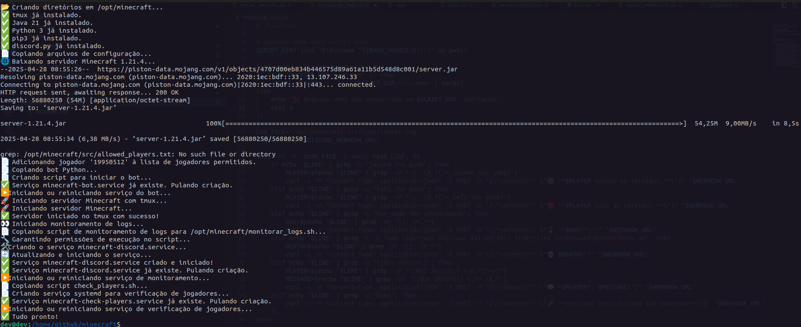

# Baixar o Client (Laucher) para jogar
https://piston-data.mojang.com/v1/objects/a7e5a6024bfd3cd614625aa05629adf760020304/client.jar


# Executar o iniciar_servidor.sh
```bash
clear && sudo ./iniciar_servidor.sh
```

